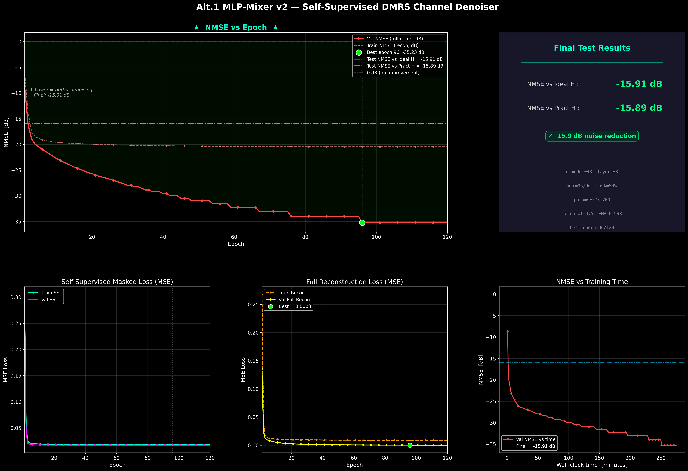
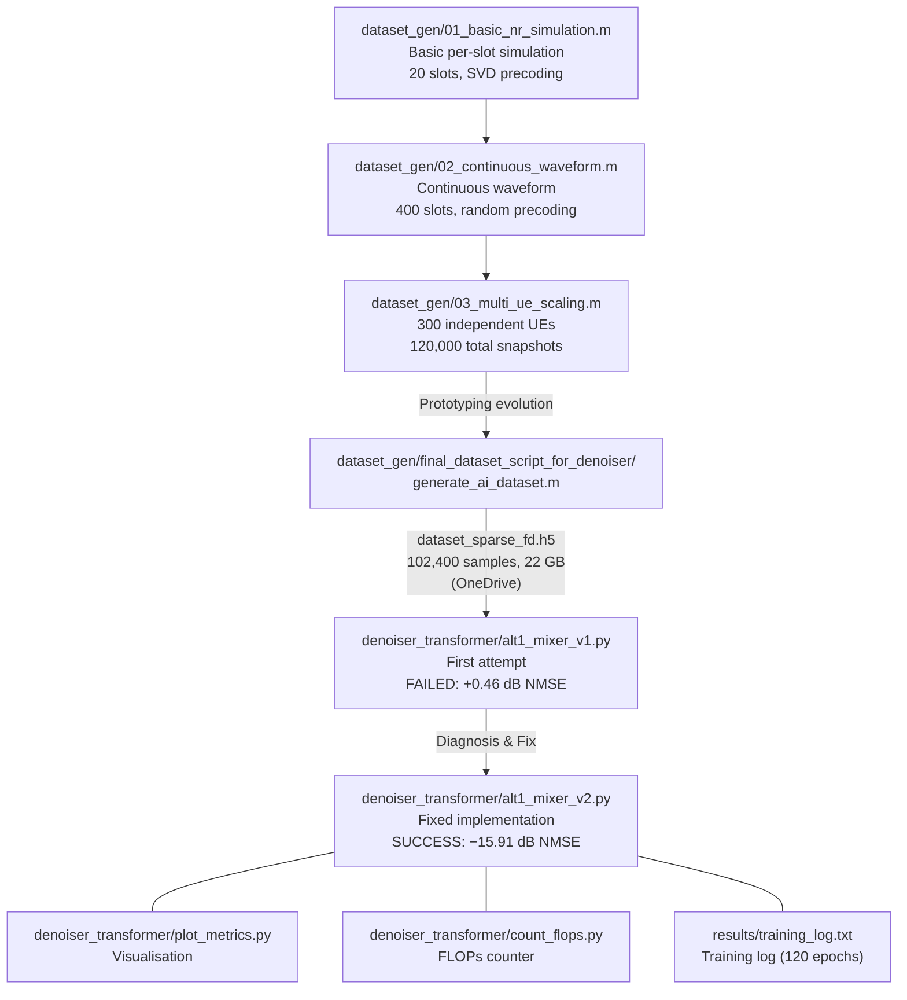

# UGP Project Report — AI-Native Sparse DMRS Channel Estimation for 5G NR / 6G

> **Purpose**: This document ensures that anyone continuing this work can understand every file, every design decision, and every experiment that led to the current state. The project focuses on **AI-native receiver design for sparse DMRS channel estimation**, implementing Samsung's Alt.1 self-supervised approach from the 3GPP RAN1 #119bis Prague meeting — a key building block for 6G AI-integrated air interfaces.

---

# Section 1: Code Explanation (Chronological Order)

---

## 1.1 `dataset_gen/01_basic_nr_simulation.m` — The Foundation

**What it is**: The first script written. Despite its name suggesting DL-SCH/PDSCH focus, it is actually a **complete 5G NR downlink simulation with dataset generation** for AI-based channel estimation.

### Simulation Parameters
- **SNR**: Fixed at 10 dB
- **Slots**: 20 total (very small — proof-of-concept scale)
- **Channel estimation**: Configurable (`perfectEstimation = false` by default)
- **RNG**: Seeded with `rng("default")` for reproducibility

### Carrier Configuration
```matlab
carrier.SubcarrierSpacing = 30;   % 30 kHz SCS (FR1)
carrier.NSizeGrid = 8;            % 8 PRBs = 96 subcarriers
carrier.CyclicPrefix = "Normal";  % 14 symbols per slot
```
This gives a **96 × 14** resource grid per slot.

### PDSCH Configuration
- **Modulation**: QPSK (robust, low-order — suitable for testing)
- **Layers**: 1 (single-layer transmission)
- **PRB allocation**: 0:7 (all 8 PRBs)
- **Symbol allocation**: [0 14] (full slot)
- **DMRS**: Type A position 2, single-symbol DMRS, 1 additional position, Config Type 1, Comb-2 density (`NumCDMGroupsWithoutData = 2`)

### DL-SCH Coding
- Code rate: 490/1024 ≈ 0.479
- LDPC decoder: Normalized min-sum, max 6 iterations
- **No HARQ** — every slot gets a fresh transport block

### MIMO & Channel
- **4 Tx, 1 Rx** antenna configuration
- **CDL-A** delay profile, 300 ns delay spread
- Carrier frequency: 4 GHz
- UE speed: 5 km/h → Doppler shift ≈ 18.5 Hz

### Precoding
- Uses **identity-based precoding** initially (`eye(1,4)`)
- Updated each slot via **SVD-based precoding** from estimated channel

### The Slot Loop (lines 86–231)
For each slot:
1. **Generate transport block** → encode with DL-SCH
2. **PDSCH modulation** → apply precoding weights
3. **Insert DMRS** into the resource grid alongside PDSCH
4. **OFDM modulate** → pass through CDL channel → add AWGN
5. **Timing synchronisation** (either perfect or estimated via `nrTimingEstimate`)
6. **OFDM demodulate** → channel estimation (perfect or via `nrChannelEstimate`)
7. **MMSE equalisation** → PDSCH decode → DL-SCH decode → report block error

### Dataset Generation
The key outputs stored per slot:
- **`inputDataset`** `[96×14×2×20]`: Sparse grid with LS channel estimates only at DMRS positions (real/imag as 2 channels)
- **`targetDataset`** `[96×14×2×20]`: Perfect channel (`ofdmChannelResponse`) after applying precoding — the "ground truth" effective channel

### Helper Functions
- `generateAWGN`: Generates complex Gaussian noise scaled by `N0 = 1/sqrt(nRxAnts * Nfft * SNR)`
- `precodeChannelEstimate`: Applies precoding matrix W to channel estimate (reshapes K×L×R tensor, multiplies by W, reshapes back)
- `getPrecodingMatrix`: SVD-based precoding — averages channel over allocated subcarriers, computes SVD, takes first `NLayers` columns of V

### Key Limitations
- **Per-slot channel call**: Each slot calls the channel independently — the channel state resets between slots (no temporal continuity)
- **Fixed precoder**: Uses identity initially, then SVD-based — not representative of random beamforming scenarios
- **Small scale**: Only 20 slots, not enough for ML training

---

## 1.2 `dataset_gen/02_continuous_waveform.m` — Continuous Waveform

**What changed**: This script fundamentally restructured the simulation to generate a **single continuous waveform** across all slots, enabling temporally coherent channel evolution.

### Major Architectural Changes

#### 1. Continuous Waveform Approach
Instead of calling the channel per-slot, the script:
1. Builds a **big resource grid** spanning all 400 slots: `bigGrid = zeros(96, 14*400, 4)`
2. Fills each slot's portion of the grid in a TX-side loop
3. **One-shot OFDM modulation**: `nrOFDMModulate(carrier, bigGrid)` — produces a single time-domain waveform
4. **Single channel call**: `channel(txWaveform, carrier)` — the CDL channel processes the entire waveform with continuous time evolution
5. **One-shot OFDM demodulation**: recovers the full received grid
6. Per-slot processing extracts slices for estimation and decoding

This ensures the **Doppler evolution is physically realistic** across slots.

#### 2. Random Precoding
```matlab
w = (randn(nTxAnts,1) + 1i*randn(nTxAnts,1));
w = w / norm(w);   % unit-norm random beam
```
Each slot gets a **random unit-norm precoder** instead of SVD-based. This is "research-grade" — it creates diverse beamforming conditions so the ML model sees varied channel-precoder interactions.

The precoder is stored: `precoderDataset(:,slotIdx) = w`

#### 3. LS Channel Estimation (Custom Implementation)
Instead of using MATLAB's `nrChannelEstimate`, a **manual LS estimator** was implemented:

```matlab
% For each DMRS port p, each DMRS RE i:
x = txDmrs(i,tx);   % known transmitted DMRS on antenna tx
y = rxDmrs(i,1);     % received signal
if abs(x) > 1e-12
    estChGridAnts(scIdx, symIdx, tx) = y / x;   % LS: H = Y/X
end
```

This estimates the **per-antenna channel** (not the effective channel), giving a `[96×14×4]` tensor per slot.

#### 4. Scattered Interpolation
After LS estimation at DMRS positions, the script uses `scatteredInterpolant` with linear interpolation and nearest-neighbour extrapolation to fill in non-DMRS positions across the time-frequency grid.

#### 5. Revised Dataset Tensors
- **`inputDataset`** `[96×14×2×400]`: Full received grid (real/imag) — not sparse DMRS anymore
- **`targetDataset`** `[96×14×4×2×400]`: Full **per-antenna** channel tensor (not effective channel) — `[SC × Sym × TxAnt × Re/Im × Slot]`
- **`txDataset`** `[96×14×2×400]`: Transmitted layer for reference
- **`precoderDataset`** `[4×400]`: Complex precoding vectors

#### 6. AWGN Calculation Change
```matlab
sigPow = mean(abs(txWaveform(:)).^2);
nVar = sigPow / SNR;
```
Now computes noise variance from **actual signal power** rather than assuming unit power.

#### 7. Scale
- 20 frames × 20 slots/frame = **400 slots** (20× more than the original script)
- Code rate changed to **340/1024** (from 490/1024)
- LDPC max iterations increased to **30** (from 6)

---

## 1.3 `dataset_gen/03_multi_ue_scaling.m` — Scaling to 300 UEs

**What changed**: Wraps the continuous simulation in an **outer UE loop** to generate 300 independent channel realisations.

### Key Differences from `02_continuous_waveform.m`

#### 1. Outer UE Loop
```matlab
for ue = 1:numUE   % numUE = 300
    release(channel);
    channel.Seed = randi([0 1e7]);
    reset(channel);
    % ... entire simulation for this UE ...
end
```
Each UE gets a **different random seed** for the CDL channel, ensuring independent fading realisations.

#### 2. Dataset Dimensions (6-D Tensors)
All datasets gain a UE dimension:
- `inputDataset` → `[96×14×2×400×300]`
- `targetDataset` → `[96×14×4×2×400×300]`
- `txDataset` → `[96×14×2×400×300]`
- `precoderDataset` → `[4×400×300]` (complex)

> [!WARNING]
> These are extremely large tensors. At float64, `targetDataset` alone is ~96×14×4×2×400×300×8 bytes ≈ **20.6 GB**.

#### 3. Per-UE BLER Tracking
```matlab
blockErrorsPerUE = zeros(numUE,1);
% ... after processing all slots for a UE:
blockErrorsPerUE(ue) = totalBlockErrors / totalNoSlots;
```

#### 4. Output File
Saved as `TF_y_x_H_dataset_continuous_LS_300UE.mat` using `-v7.3` (HDF5 format for large files).

Everything else (LS estimation, interpolation, equalization, decoding) is identical to the single-UE version.

---

## 1.4 `denoiser_transformer/` Directory — Samsung Alt.1 Self-Supervised Denoiser

Based on **Samsung's TDoc R1-2500xxx** presented at **3GPP RAN1 #119bis, Prague (October 2025)** — proposing Alt.1: self-supervised learning for channel estimation at sparse DMRS positions.

### 1.4.1 `alt1_mixer_v1.py` — Version 1 (Original Implementation)

This was the **first attempt** at implementing Samsung's Alt.1 idea. Key characteristics:

#### Architecture: MLP-Mixer
- **d_model = 32**, 2 Mixer blocks
- Token-mixing MLP: 64-dim hidden
- Channel-mixing MLP: 64-dim hidden
- ~113K parameters, ~13.6 MFLOPs

#### Self-Supervised Training (SSL)
The core Alt.1 idea: **no ideal channel labels needed**.
1. Extract LS estimates at 408 DMRS positions → each is a 4-float token `[re_p0, im_p0, re_p1, im_p1]`
2. Randomly **mask 25%** of tokens (replace with learned `[MASK]` token)
3. MLP-Mixer processes all tokens with spatial mixing
4. **Loss**: MSE between predicted and original noisy LS values at **masked positions only**

#### Key Components
- **`Pos2DEncoding`**: 2D continuous positional encoding using learnable log-spaced frequency banks — maps `(sc_norm, sym_norm) ∈ [0,1]²` to d_model dimensions
- **`SNRConditioner`**: FiLM-style conditioning — embeds scalar SNR(dB) into `(γ, β)` scale/shift parameters applied after token mixing
- **`DropPath`**: Stochastic depth for regularisation
- **`MixerBlock`**: LayerNorm → Token-mixing (transpose, MLP over N dim, transpose back) → FiLM → LayerNorm → Channel-mixing MLP

#### Loss Function
```python
def ssl_loss(pred, target, mask):
    mse = ((pred - target) ** 2).mean(-1)   # [B, N]
    return mse[mask].mean()                  # only masked positions
```

#### Checkpoint Selection
Saved best model based on `va_ssl` (masked validation loss).

#### Dataset Format (HDF5)
Expected keys: `input_ls_real/imag [N,2,14,612]`, `dmrs_mask [14,612]`, `snr_db [N]`, plus optional `alt1_ideal_real/imag` and `alt1_pract_real/imag` for offline NMSE evaluation.

### 1.4.2 `alt1_mixer_v2.py` — Version 2 (Fixed Implementation)

This is the **corrected version** after diagnosing v1's failures. It is an **MLP-Mixer** architecture.

#### What Changed (v1 → v2)

| Aspect | v1 (`alt1_mixer_v1.py`) | v2 (`alt1_mixer_v2.py`) |
|--------|---------------|---------------------------|
| d_model | 32 | **48** |
| Layers | 2 | **3** |
| Mix dims | 64/64 | **96/96** |
| Mask ratio | 25% | **50%** |
| Loss | SSL masked only | **SSL + 0.5 × full-recon** |
| Checkpoint metric | `va_ssl` | **`va_full`** |
| EMA | None | **decay=0.998** |
| Early stopping | None | **patience=20** |
| Dropout/drop_path | 0.05 | **0.10** |
| Epochs | 80 | **120** |
| Parameters | ~113K | **~273K** |

#### New: Combined Loss
```python
def combined_loss(pred, target, mask, recon_weight=0.5):
    mse_per_token = ((pred - target) ** 2).mean(-1)
    ssl_loss   = mse_per_token[mask].mean()       # masked positions
    recon_loss = mse_per_token.mean()               # ALL positions
    total = ssl_loss + recon_weight * recon_loss
    return total, ssl_loss, recon_loss
```

#### New: EMA (Exponential Moving Average)
```python
class ModelEMA:
    def update(self, model):
        for ema_p, model_p in zip(...):
            ema_p.data.mul_(self.decay).add_(model_p.data, alpha=1 - self.decay)
```
The EMA model is used for validation and final evaluation — produces smoother weights.

#### New: Validation uses EMA model
```python
va = run_epoch(ema.ema_model, val_dl, cfg, device)  # NOT the training model
```

#### Dataset HDF5 Axis Order Change
v2 reads HDF5 data with transposed axis order `[N, 2, 14, 612]` (sample-first) vs v1's `[612, 14, 2, N]` (grid-first). The `__getitem__` indexing adjusts accordingly.

### 1.4.3 `plot_metrics.py` — Training Visualisation

Parses `results/training_log.txt` and generates a **5-panel dashboard** (`results/training_metrics.png`):
1. **NMSE vs Epoch** (main panel): Val/Train NMSE in dB, best epoch marker, test NMSE reference lines
2. **Summary Card**: Final test NMSE, model config, noise reduction achieved
3. **SSL Masked Loss**: Train vs Val SSL loss curves
4. **Full Reconstruction Loss**: Train recon vs Val full-recon with best-epoch marker
5. **NMSE vs Training Time**: Wall-clock convergence speed

Uses dark theme with neon colours for publication-quality output.

### 1.4.4 `count_flops.py` — FLOPs Counter

Counts model FLOPs using three methods:
1. PyTorch's built-in `FlopCounterMode` (≥ 2.1)
2. `thop` library
3. Manual parameter count (always works)

Creates dummy inputs matching the model's expected shapes and runs a forward pass.

### 1.4.5 `results/training_log.txt` — Training Log (v2 Results)

120 epochs of training with the v2 model. Key observations from the log:
- **Epoch 1**: va_full=0.1354 (starting point)
- **Epoch 10**: va_full=0.0053 (rapid initial improvement)
- **Epoch 50**: va_full=0.0008 (continued steady improvement)
- **Epoch 96**: va_full=0.0003 (best checkpoint, −35.23 dB proxy NMSE)
- **Epoch 120**: va_full=0.0003 (no early stopping triggered — kept improving)
- **Final Test NMSE vs Ideal H: −15.91 dB** ✅
- **Final Test NMSE vs Pract H: −15.89 dB** ✅

---

## 1.5 Training Dataset (`dataset_sparse_fd.h5`)

> [!IMPORTANT]
> The Alt.1 model was trained on a purpose-built 21.8 GB HDF5 dataset. The generation script is at `dataset_gen/final_dataset_script_for_denoiser/dataset/generate_ai_dataset.m`. The output file is hosted on OneDrive due to its size.

**Link**: [OneDrive — dataset_sparse_fd.h5](https://1drv.ms/f/c/630f9b47e52a7119/IgD1YY3KvhmTQbQGa6NlAH59AUw5l8LlGeAF9gJUGRve2zQ?e=HQAhgg)

**Generation Stats**:
- **Total samples**: 102,400
- **Generation time**: 18.0 hours (1,082.8 minutes)
- **File size**: 21.8 GB
- **Format**: Single HDF5 file

**Dataset Structure**:

| Key | Shape | Description |
|-----|-------|-------------|
| `/input_ls_real` | `[612, 14, 2, N]` | LS estimates at DMRS positions (zero elsewhere), real part |
| `/input_ls_imag` | `[612, 14, 2, N]` | LS estimates at DMRS positions (zero elsewhere), imag part |
| `/dmrs_mask` | `[612, 14]` | Binary mask — 1 at DMRS resource elements |
| `/alt1_ideal_real/imag` | `[408, 2, N]` | Perfect channel H at DMRS positions only |
| `/alt1_pract_real/imag` | `[408, 2, N]` | MMSE@30 dB channel at DMRS positions only |
| `/alt2_ideal_real/imag` | `[612, 14, 2, N]` | Perfect channel H at ALL resource elements |
| `/alt2_pract_real/imag` | `[612, 14, 2, N]` | MMSE@30 dB channel at ALL resource elements |
| `/snr_db` | `[N]` | Per-sample SNR in dB |
| `/rms_norm` | `[N]` | Per-sample RMS normalisation factor |
| `/slot_idx` | `[N]` | Per-sample slot index |

**Key design points**:
- Grid size is **612 subcarriers × 14 OFDM symbols** (51 PRBs, much larger than the 8 PRBs in the MATLAB scripts)
- **2 Rx antenna ports** (vs 1 Rx in the MATLAB scripts)
- **408 DMRS REs** out of 612×14 = 8,568 total REs per slot
- All values are **normalised by per-sample RMS** of LS estimates — this is critical for the model to generalise across SNR
- Contains both **Alt.1 labels** (DMRS-only, 408 REs) and **Alt.2 labels** (full grid, 612×14 REs) — the current model uses Alt.1
- `alt1_ideal` = perfect noiseless channel; `alt1_pract` = MMSE estimated at 30 dB SNR (practical upper bound)
- Neither ideal nor practical labels are used during SSL training — they are **only for offline NMSE evaluation**

> [!NOTE]
> The MATLAB scripts `01_basic_nr_simulation.m`, `02_continuous_waveform.m`, `03_multi_ue_scaling.m` document the **evolution of the simulation approach** and were used for prototyping. The production dataset was generated by `dataset_gen/final_dataset_script_for_denoiser/dataset/generate_ai_dataset.m`.

### 1.5.1 Production Script: `generate_ai_dataset.m`

**Location**: `dataset_gen/final_dataset_script_for_denoiser/dataset/generate_ai_dataset.m`

This is the script that produced the 21.8 GB training dataset. Key configuration:

| Parameter | Value |
|-----------|-------|
| Carrier frequency | 4 GHz |
| SCS | 30 kHz |
| Bandwidth | 20 MHz (51 PRBs, 612 subcarriers) |
| Channel | CDL-C, 100 ns delay spread |
| UE speed | 30 km/h |
| Antennas | 4 Tx, 2 Rx, 1 layer |
| Modulation | 64QAM |
| SNR range | 0–30 dB (step 2, 16 levels) |
| Slots per SNR | 6,400 |
| Total samples | 102,400 |
| Practical label SNR | 30 dB (MMSE) |
| DMRS pattern | `sparse_fd` (Type 2, 8 DMRS REs/PRB) |

**Generation pipeline per sample**:
1. Generate and transmit PDSCH with SVD precoding
2. Pass through CDL-C channel + AWGN at actual SNR
3. OFDM demodulate → compute LS estimates at DMRS positions
4. Generate ideal labels via `hpre6GPerfectChannelEstimate`
5. Generate practical labels via `hpre6GChannelEstimate` at 30 dB
6. RMS-normalise all values per sample
7. Write to HDF5 with chunked compression (Deflate level 4)

**Supporting files in `final_dataset_script_for_denoiser/`**:
- `config/evm_pdsch_lls.m` — EVM simulation configuration builder
- `config/antenna_configs.m` — Antenna array geometry
- `dmrs/dmrs_config.m` — DMRS pattern definitions (nr_baseline, sparse_fd, sparse_td, sparse_fd_td)
- `sim/run_pdsch_lls.m` — PDSCH link-level simulation runner
- `run_6g_dmrs_evaluation.m` — Master evaluation script for multi-pattern comparison
- `utils/compute_reserved_re_for_fixed_tbs.m` — Transport block size helper

---

# Section 2: Experiment Log

---

## Experiment Timeline

### Phase 1: Literature Review & 3GPP Study (Dec 2025 – Jan 2026)

**Goal**: Build foundational understanding of AI/ML integration into the NR air interface, with focus on AI-native receiver and transmitter architectures for sparse DMRS channel estimation.

**What was studied**:
- 3GPP Release 18/19 Study Item on **AI/ML for NR Air Interface** — covering AI-based channel estimation, beam management, and positioning
- TDocs from **3GPP RAN1 meetings** on AI receiver and AI transmitter designs
- Alt.1 (self-supervised) vs Alt.2 (supervised) approaches for channel estimation
- The challenge of **sparse DMRS**: only ~4.8% of REs are DMRS in typical NR configurations — AI must learn to denoise from very limited pilot observations
- NR physical layer fundamentals: resource grids, OFDM, CDL channel models, MIMO precoding

**Outcome**: ✅ Identified the Alt.1 self-supervised approach as the implementation target — lightweight, label-free, and aligned with 3GPP standardisation direction for 6G.

---

### Phase 2: MATLAB Simulation & Dataset Generation (Jan – early Mar 2026)

#### Phase 2a: Basic 5G NR Simulation (`dataset_gen/01_basic_nr_simulation.m`)

**Goal**: Build a working 5G NR downlink pipeline that generates input-target pairs for the AI receiver.

**What was done**:
- Implemented a complete PDSCH transmission-reception chain using MATLAB's 5G Toolbox
- Used `nrChannelEstimate` for channel estimation and SVD-based precoding
- Generated sparse DMRS-only input (LS estimates at pilot positions) and perfect effective channel as target

**Outcome**: ✅ Working simulation producing valid datasets. Block errors reported correctly.

**Limitation discovered**: Per-slot channel calls reset the CDL channel state — no temporal continuity between slots.

---

#### Phase 2b: Continuous Waveform (`dataset_gen/02_continuous_waveform.m`)

**Goal**: Fix the temporal discontinuity by processing the entire waveform through the channel in one call.

**Key experiments**:

1. **Big-grid approach**: Built a single `[96 × (14×400) × 4]` resource grid, OFDM-modulated it once, passed through channel once — preserves CDL channel state across all 400 slots.

2. **Random precoding**: Replaced SVD-based precoding with random unit-norm precoders for beamforming diversity.

3. **Custom LS estimator**: Manual `H = Y/X` at DMRS REs for per-antenna channel estimates.

4. **Signal-power-based AWGN**: `nVar = sigPow/SNR` instead of the formula-based approach.

**Outcome**: ✅ Temporally coherent channel with realistic Doppler evolution.

#### Phase 2c: Multi-UE Scaling (`dataset_gen/03_multi_ue_scaling.m`)

**Goal**: Generate data diversity by simulating 300 independent UEs with different CDL seeds.

**Outcome**: ✅ 300×400 = 120,000 channel snapshots. Served as prototype for the production dataset.

---

#### Phase 2d: Production Dataset Generation (`dataset_sparse_fd.h5`)

**Goal**: Generate production-quality training dataset at full NR scale.

**What was done**:
- Scaled to **51 PRBs (612 subcarriers)** with **2 Rx ports**
- Generated **102,400 samples** in **18 hours**
- Output: `dataset_sparse_fd.h5` (21.8 GB) — [OneDrive link](https://1drv.ms/f/c/630f9b47e52a7119/IgD1YY3KvhmTQbQGa6NlAH59AUw5l8LlGeAF9gJUGRve2zQ?e=HQAhgg)
- **Sparse format**: LS estimates only at DMRS positions (zero elsewhere) — hence `sparse_fd`
- All values **RMS-normalised** per-sample for cross-SNR generalisation

**Outcome**: ✅ Definitive training dataset for both Alt.1 v1 and v2 models.

---

### Phase 3: Alt.1 AI Model Design (Mar–Apr 2026)

#### Background: Samsung's Proposal

At **3GPP RAN1 #119bis in Prague (October 2025)**, Samsung proposed "Alt.1" for AI-based channel estimation:

- **Key idea**: Train a neural network using **only noisy LS estimates** — no ideal channel labels needed (self-supervised)
- **Method**: Mask random DMRS positions, train the model to predict the masked LS values from the unmasked ones
- **Backbone**: MLP-Mixer (lightweight, fits UE complexity constraints ~14 MFLOPs)
- **Pipeline**: `r, p → LS estimation → [AI Denoise @ DMRS] → Freq interpolation → Time interpolation → h_est`

The model only operates on the 408 DMRS resource elements, not the full grid. This keeps complexity low.


#### Experiment 3a: First Implementation (`alt1_mixer_v1.py`) — FAILED

**Configuration**:
- d_model=32, 2 layers, 64-dim mixers
- 25% mask ratio
- SSL loss on masked tokens only
- Checkpoint on `va_ssl`
- 80 epochs, no EMA, no early stopping

**Results**:

| Metric | Value | Verdict |
|--------|-------|---------|
| NMSE vs Ideal H | **+0.46 dB** | ❌ Worse than raw LS |
| NMSE vs Pract H | **+0.46 dB** | ❌ Worse than MMSE@30dB |
| SSL Masked Loss (val) | ~0.02 | ✅ Converged |
| Full Reconstruction Loss | ~0.63 (diverged) | ❌ Severely degraded |

**Diagnosis** (performed collaboratively with AI assistant):

1. **SSL Shortcut Learning**: The model learned to predict masked tokens by trivially interpolating from nearby unmasked tokens (306 visible → 102 masked). It never learned the actual channel structure. Evidence: SSL loss converged perfectly but full-recon loss diverged after epoch ~10.

2. **Overfitting to Noise**: The reconstruction target is the noisy LS estimate itself. The model collapsed to near-identity on unmasked tokens but amplified noise at inference when no tokens are masked.

3. **Wrong checkpoint metric**: Saving on `va_ssl` kept the model that was best at the shortcut task, not the one that actually denoised well. The best denoising performance was around epoch 8-10.

4. **Insufficient capacity**: d_model=32 with 2 layers may have been too shallow for complex CDL-A channels.

#### Experiment 3b: Diagnosis & Fix Planning

A detailed analysis was performed (documented in conversation `a6ae3a0e`):

**Root cause summary**: The issue was **not the architecture** (which faithfully implements Samsung's proposal) — it was the **training methodology**. Six specific fixes were identified:

1. Checkpoint on `va_full` instead of `va_ssl`
2. Increase mask ratio (25% → 50%) to force global learning
3. Add full-reconstruction regulariser to the loss
4. Increase model capacity (within FLOPs budget)
5. Add EMA for smoother evaluation weights
6. Add early stopping based on `va_full`

#### Experiment 3c: Version 2 (`alt1_mixer_v2.py`) — SUCCESS

**All six fixes applied simultaneously**:

| Fix | Rationale |
|-----|-----------|
| **50% masking** | Only 204 visible tokens → model must learn global channel smoothness, can't just interpolate locally |
| **Combined loss** (SSL + 0.5×full-recon) | The full-recon term penalises the model if unmasked tokens diverge — prevents shortcut learning |
| **Checkpoint on `va_full`** | Saves the model that actually reconstructs all DMRS well, not just the masked prediction task |
| **EMA (decay=0.998)** | Validation/test uses smoothed weights — less noisy, more generalised |
| **Larger model** (d=48, 3 layers, 96-dim) | 273K params vs 113K — more capacity for complex channel structure, still within ~30M FLOPs |
| **Early stopping (patience=20)** | Prevents wasted compute; in practice the model kept improving so it wasn't triggered |

**Training Dynamics**:



Key observations:
- **No divergence**: Full-recon loss decreases monotonically (the v1 failure mode is completely fixed)
- **SSL loss** saturates around 0.0170 by epoch ~10 — this is expected (it's bounded by the noise in the LS pseudo-labels)
- **va_full** keeps decreasing through all 120 epochs (0.1354 → 0.0003)
- Training took ~4.5 hours total on CUDA GPU

**Final Results**:

| Metric | v1 (`alt1_mixer_v1.py`) | v2 (`alt1_mixer_v2.py`) |
|--------|--------------|---------------------------|
| NMSE vs Ideal H | +0.46 dB ❌ | **−15.91 dB** ✅ |
| NMSE vs Pract H | +0.46 dB ❌ | **−15.89 dB** ✅ |
| Full Recon Loss | 0.63 (diverged) | **0.0003** (converged) |
| Noise Reduction | None | **15.9 dB** |

> [!IMPORTANT]
> The −15.91 dB NMSE means the model reduces channel estimation error by a factor of ~39× compared to raw LS estimates. This is an excellent result for a self-supervised model with no ideal labels.

---

## Summary of File Relationships



> [!IMPORTANT]
> The MATLAB scripts document the **simulation design evolution**. The actual 22 GB training dataset (`dataset_sparse_fd.h5`, 102,400 samples) was generated by a separate production script and is hosted on OneDrive.

---

## Key Takeaways for Future Work

1. **The continuous waveform approach is essential** — per-slot channel calls create unrealistic temporal discontinuities
2. **Random precoding is better for ML training** than SVD — it creates diverse conditions
3. **Self-supervised channel estimation works** but is extremely sensitive to training methodology:
   - Mask ratio must be high enough (≥50%) to prevent shortcut learning
   - Full-reconstruction regulariser is critical to prevent unmasked token divergence
   - Checkpoint metric must reflect actual denoising quality, not just the pretext task
4. **EMA is important** for stable evaluation in self-supervised settings
5. The **MLP-Mixer backbone** faithfully implements Samsung's Alt.1 (TDoc R1-2500xxx) and achieves strong results (−15.91 dB NMSE) with only 273K parameters

### Open Directions
- Test at different SNR ranges (currently fixed at 10 dB for dataset generation)
- Try different delay profiles (CDL-B, CDL-C, CDL-D)
- Increase UE speed beyond 5 km/h to test high-Doppler scenarios
- Integrate the Alt.1 denoiser back into the full estimation pipeline (freq/time interpolation after denoising)
- Compare against supervised baselines using the same dataset
