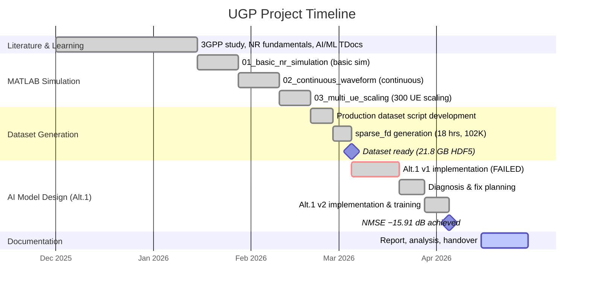

# Project Timeline

## AI-Native Sparse DMRS Channel Estimation for 5G NR / 6G

---

---

## Phase-wise Breakdown

### Phase 1: Literature Review & 3GPP Study (Dec 2025 – Jan 2026)

**Goal**: Build foundational understanding of AI/ML integration into the NR air interface, with focus on AI-native receiver and transmitter architectures for sparse DMRS channel estimation.

**What was studied**:
- 3GPP Release 18/19 Study Item on **AI/ML for NR Air Interface** — covering AI-based channel estimation, beam management, and positioning
- TDocs from **3GPP RAN1 meetings** on AI receiver and AI transmitter designs
- Alt.1 (self-supervised) vs Alt.2 (supervised) approaches for channel estimation
- The challenge of **sparse DMRS**: only ~4.8% of REs are DMRS in typical NR configurations — AI must learn to denoise from very limited pilot observations
- NR physical layer fundamentals: resource grids, OFDM, CDL channel models, MIMO precoding

**Outcome**: Identified the Alt.1 self-supervised approach as the implementation target — lightweight, label-free, and aligned with 3GPP standardisation direction for 6G.

---

### Phase 2: MATLAB Simulation & Dataset Generation (Jan – early Mar 2026)

#### Phase 2a: Basic 5G NR Simulation (mid Jan 2026)

**File**: `dataset_gen/01_basic_nr_simulation.m`

- Built complete 5G NR downlink chain using MATLAB 5G Toolbox
- Configuration: 4×1 MIMO, CDL-A channel, 30 kHz SCS, 8 PRBs, QPSK
- Generated 20 slots with SVD-based precoding
- **Limitation found**: Per-slot channel calls → no temporal continuity

#### Phase 2b: Continuous Waveform (late Jan – Feb 2026)

**File**: `dataset_gen/02_continuous_waveform.m`

- Restructured to **single continuous waveform** across 400 slots
- One-shot OFDM modulation → single channel call → one-shot demodulation
- Random unit-norm precoding for beamforming diversity
- Custom LS channel estimator with scattered interpolation

#### Phase 2c: Multi-UE Scaling (mid Feb 2026)

**File**: `dataset_gen/03_multi_ue_scaling.m`

- 300 independent UEs with randomised CDL seeds
- Total: 120,000 channel snapshots
- Served as prototype for the production dataset

#### Phase 2d: Production Dataset (late Feb – early Mar 2026)

**File**: `dataset_gen/final_dataset_script_for_denoiser/dataset/generate_ai_dataset.m`

- Production-scale script using MATLAB 6G Exploration Library (`pre6G` APIs)
- Scaled to **51 PRBs (612 subcarriers)**, **2 Rx ports**, CDL-C, 4 GHz, 30 km/h
- SNR range: 0–30 dB (16 levels × 6,400 slots each)
- **102,400 samples** generated in **18 hours**
- Output: `dataset_sparse_fd.h5` (21.8 GB) — [OneDrive](https://1drv.ms/f/c/630f9b47e52a7119/IgD1YY3KvhmTQbQGa6NlAH59AUw5l8LlGeAF9gJUGRve2zQ?e=HQAhgg)

---

### Phase 3: Alt.1 AI Model Design (Mar – Apr 2026)

#### Phase 3a: First Attempt — FAILED (early–mid Mar 2026)

**File**: `denoiser_transformer/alt1_mixer_v1.py`

- MLP-Mixer: d_model=32, 2 layers, ~113K params
- 25% mask ratio, SSL loss on masked tokens only
- **Result**: +0.46 dB NMSE — worse than raw LS estimates ❌

#### Phase 3b: Diagnosis & Fix Planning (late Mar 2026)

**Root causes**: Shortcut learning (masking too easy), wrong checkpoint metric, no regularisation on unmasked tokens, insufficient capacity.

**Six fixes planned**:

| # | Fix | Rationale |
|---|-----|-----------|
| 1 | Mask ratio 25% → **50%** | Force global channel learning |
| 2 | Add **full-recon regulariser** (weight=0.5) | Prevent unmasked divergence |
| 3 | Checkpoint on **`va_full`** | Save model that denoises well |
| 4 | Add **EMA** (decay=0.998) | Smoother evaluation weights |
| 5 | Increase capacity: **d=48, 3 layers** | More capacity within FLOPs budget |
| 6 | Add **early stopping** (patience=20) | Prevent overfitting |

#### Phase 3c: Fixed Implementation — SUCCESS (late Mar – early Apr 2026)

**File**: `denoiser_transformer/alt1_mixer_v2.py`

- All six fixes applied, trained 120 epochs (~4.5 hrs on CUDA GPU)
- **Result**: −15.91 dB NMSE ✅ (15.9 dB noise reduction)

| Metric | v1 (alt1_mixer_v1.py) | v2 (alt1_mixer_v2.py) |
|--------|:-----------:|:------------------------:|
| NMSE vs Ideal H | +0.46 dB ❌ | **−15.91 dB** ✅ |
| Parameters | ~113K | ~273K |
| Noise Reduction | None | **15.9 dB** |

#### Phase 3d: Documentation (Apr 2026)

- Training metrics visualisation
- Project report and handover documentation

---

## Key Milestones

| Date | Milestone |
|------|-----------|
| Dec 2025 | Project start — literature review begins |
| mid Jan 2026 | First working NR simulation |
| mid Feb 2026 | Continuous waveform & multi-UE prototypes |
| early Mar 2026 | Production dataset `sparse_fd` ready (102K samples, 21.8 GB) |
| mid Mar 2026 | Alt.1 v1 failure diagnosed |
| early Apr 2026 | Alt.1 v2 achieves −15.91 dB NMSE |
| Apr 29, 2026 | Project report finalised |
